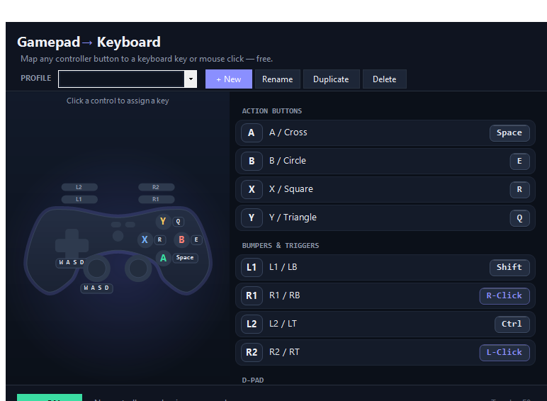

# Gamepad to Keyboard — Play Keyboard-Only Games With a Controller

A free Windows tool that turns any gamepad into a keyboard. Pick a button on your controller, press the keystroke you want it to send, save a profile, and the pad now types into whatever has focus — an emulator, a browser game, a retro title that never saw a joystick, a strategy game that only knows about arrow keys. **Gamepad to Keyboard** runs on Windows 10 and Windows 11, is free with no account, has no watermark and no ads.

The point of the project is specific: a lot of great PC games are keyboard-only by design. The old DOS catalogue, point-and-click adventures, early strategy titles, countless browser games, and almost every emulator menu assume a keyboard is in front of you. This tool bridges that gap without the detour of a virtual controller.

## Download

**Download for Windows:** <https://go.download-helper.tech/go/G2K>

The archive is a portable ZIP. Right-click it, choose Extract All, open the folder it creates, and launch the included app from there. Nothing is written outside that folder — delete it and the tool is gone from the machine.

## What it does

- **Every input on the pad is remappable** — A, B, X, Y, bumpers, triggers, D-pad directions, both analog sticks and their L3/R3 clicks all land on whatever keyboard key you choose.
- **Keys or mouse clicks** — bind any button to a left, right or middle mouse click, so a game that needs point-and-shoot runs from the pad without reaching for the mouse.
- **Profiles with presets** — start from WASD Shooter, Retro / Arcade, Move + Mouse, or a blank slate; name the profile, duplicate it, swap between layouts in one click.
- **Live controller view** — an on-screen pad mirrors your actual hands and lights up green the instant a button fires, so you can see every mapping work in real time.
- **Global F8 toggle** — flip the whole mapping layer off and back on from any focused window; no Alt-Tab, no leaving the game.
- **Real keystrokes, not a virtual pad** — the tool sends operating-system-level keyboard events, so games that reject virtual controllers accept them anyway.
- **Zero-lag input** — built on SDL2, the same controller library the games industry uses; presses register the moment they happen.
- **Broad hardware** — Xbox Series X/S, Xbox One, Xbox 360, DualShock 4, DualSense (including the touchpad click), Switch Pro Controller, and generic USB or Bluetooth pads.
- **Portable, driver-free** — unzip anywhere and run; no driver install, no background service, no admin elevation, nothing left in the registry.
- **MIT licensed and open source** — the source code is public and auditable.

## Four-step setup

1. Plug in your controller over USB, or pair it over Bluetooth from Windows settings. SDL2 detects it the moment it is live.
2. Open the extracted folder and launch the app. The on-screen pad mirrors your controller.
3. Click a button on the on-screen pad, then press the keyboard key or mouse button you want it to send. Repeat for every input you care about.
4. Save the layout as a named profile, press **F8**, and the pad is now a keyboard inside whatever game or app has focus.

## FAQ

**Is it really free?**
Yes. Free forever, no trial timer, no feature paywalled behind a Pro tier. MIT licensed.

**Does it work on Windows 11?**
Yes. Windows 10 and Windows 11, 64-bit, both tested.

**Does it need an account?**
No. The app opens straight to the mapping grid. There is nothing to register and no cloud sync.

**Does it need internet?**
No. Everything happens locally. No telemetry, no update ping, no network calls at all once the download is finished.

**Does it need admin rights?**
No. The app runs as a regular user process. It does not install drivers or start a Windows service.

**Will it get banned by anti-cheat?**
The tool sends real keyboard events — the same kind of events a USB keyboard would send. Most games accept them. Online titles with kernel-level anti-cheat may still forbid any form of input translation; respect each title's rules.

## System requirements

- Windows 10 or Windows 11, 64-bit.
- A controller — wired over USB or paired over Bluetooth.
- SDL2 (bundled with the download, no separate install).

That is the full dependency list. The portable build carries everything else.

Website: <https://gamepadtokeyboard.com>

## License

MIT — free to use, modify, and share. Not affiliated with or endorsed by Microsoft, Sony, or Nintendo. All controller brand names are trademarks of their respective owners.
